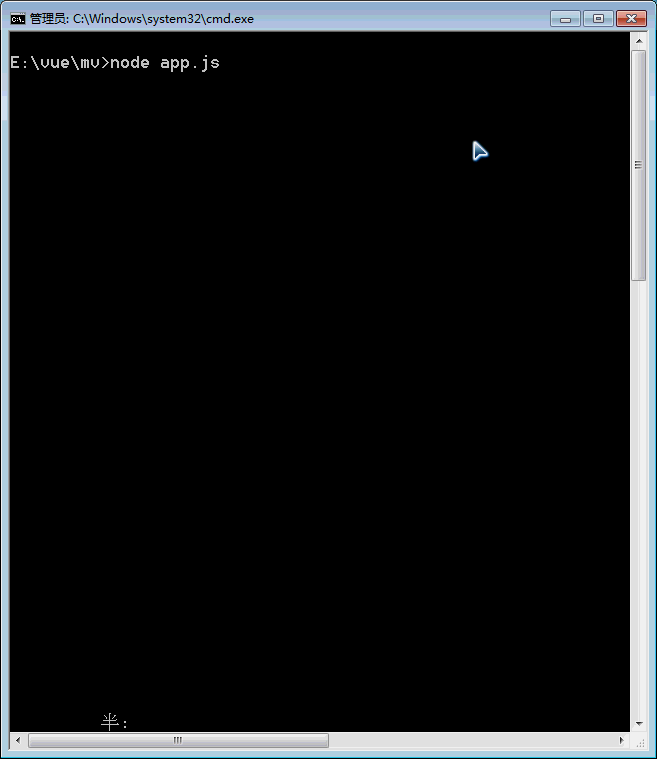

# aaqqc 网页采集器

Node.js 实现的网页数据采集工具，用于采集 aaqqc.com 网站数据。

## 演示截图



## 功能特性

- 网页数据采集
- 支持 MySQL 数据存储
- 使用 Cheerio 解析 HTML

## 项目结构

```
aaqqc/
├── index.js      # 入口文件
├── app.js       # 应用主逻辑
├── demo.gif     # 演示动画
├── package.json # 依赖配置
└── README.md
```

## 技术栈

| 技术 | 说明 |
|------|------|
| Node.js | JavaScript 运行时 |
| Cheerio | HTML 解析库 |
| Knex | SQL 查询构建器 |
| MySQL | 数据库 |

## 安装

```bash
npm install
```

## 配置

在 `index.js` 或 `app.js` 中配置数据库连接信息。

## 运行

```bash
node index.js
```

## 依赖说明

| 包 | 版本 | 说明 |
|----|------|------|
| cheerio | ^1.0.0-rc.2 | HTML 解析库 |
| knex | ^0.16.2 | SQL 查询构建器 |
| mysql | ^2.16.0 | MySQL 驱动 |
| mysql2 | ^1.6.4 | MySQL 驱动（新版） |

## 相关链接

- [aaqqc 网站](http://m.aaqqc.com)
